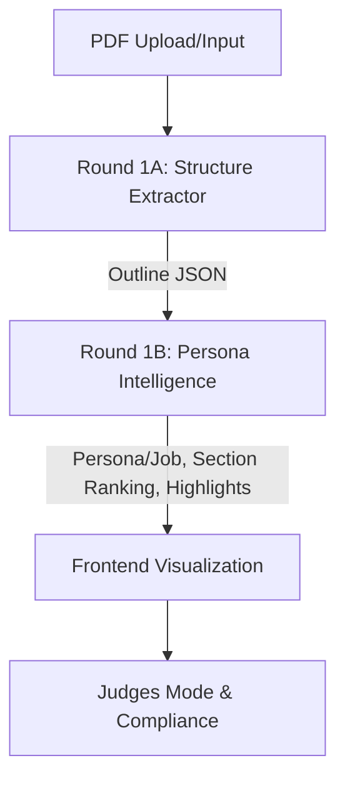

# Adobe India Hackathon: Connecting the Dots

This repository contains a robust, modular, and high-performance offline solution for both Round 1A (Document Structure Extraction) and Round 1B (Persona-Driven Document Intelligence), following all official hackathon rules and constraints.

---

## Our Approach

### Phase 1: Analysis & Technology Selection
- **PDF Parsing:** We use PyMuPDF (`fitz`) for extracting text, font size, weight, and position, providing fine-grained control for heading detection and supporting multilingual documents.
- **NLP/Semantics:** For Round 1B, we use `sentence-transformers` with the `paraphrase-multilingual-MiniLM-L12-v2` model, which is small (<120MB), CPU-optimized, and supports many languages for semantic similarity ranking.

### Phase 2A: Structure Extraction (Round 1A)
- **Heading Detection Heuristic:**
  - Combines font size, boldness, left margin, and line spacing.
  - Recognizes numbered/section headings (e.g., "1. Introduction").
  - Utilizes document metadata and TOC if available.
  - Handles multilingual text by detecting CJK (Japanese, Chinese, Korean) scripts and applying the same heuristics.
- **Output:**
  - JSON file per PDF: `{ "title": ..., "outline": [{"level": "H1", "text": ..., "page": ...}, ...] }`
  - Fully offline, processes `/app/input` and writes to `/app/output`.

### Phase 2B: Persona-Driven Intelligence (Round 1B)
- **Section Ranking:**
  - Loads the outline from Round 1A.
  - Embeds the combined persona/job-to-be-done as a query vector.
  - Embeds each section and computes cosine similarity for ranking.
- **Sub-section Analysis:**
  - For the top N sections, splits text into paragraphs/sentences and re-ranks for fine-grained insight.
- **Output:**
  - JSON file per document, with `Metadata`, `Extracted Sections` (with importance rank), and `Sub-section Analysis`.
- **Performance:**
  - All models and code run on CPU, offline, and within the required time and size constraints.

---

## Models and Libraries Used
- **PyMuPDF (`fitz`):** PDF parsing and layout analysis
- **sentence-transformers:** Embedding text for semantic similarity
- **paraphrase-multilingual-MiniLM-L12-v2:** Multilingual transformer model (offline, <120MB)
- **scikit-learn:** Cosine similarity calculation
- **numpy:** Array operations

---

## How to Build and Run

### Build the Docker Image
```sh
docker build -t adobe-hackathon .
```

### Run Round 1A (Structure Extraction)
```sh
docker run --rm -v $(pwd)/input:/app/input -v $(pwd)/output:/app/output adobe-hackathon
```
- Place PDFs in `./input`. Extracted outlines will be saved as JSON in `./output`.

---

## 🚀 Quickstart

1. **Build the Docker image:**
   ```bash
   docker build --platform linux/amd64 -t connecting-dots:latest .
   ```
2. **Run the container with input/output folders:**
   ```bash
   docker run --rm -v $(pwd)/input:/app/input -v $(pwd)/output:/app/output --network none connecting-dots:latest
   ```
3. **Webapp (optional):**
   - Start Flask: `python3 frontend/app.py`
   - Visit: [http://localhost:5000](http://localhost:5000)

---

## 🛠️ Pipeline Diagram



---

## ❓ FAQ

**Q: Does this work offline and on CPU?**
A: Yes, all models and code run fully offline and on CPU (AMD64). No web/API calls.

**Q: How do I process multiple PDFs?**
A: Place all PDFs in `/input` and outputs will appear in `/output` after running the container.

**Q: How are headings detected?**
A: Using a combination of font size clustering, boldness, margin, spacing, TOC cross-checks, and multilingual heuristics.

**Q: How do I use Judges Mode?**
A: Click the "Judges Mode" button in the webapp to see explainability and compliance details for each run.

**Q: Can I run a quick demo?**
A: Yes, use the "One-Click Demo" button in the webapp (sample.pdf required).

---

## 🏆 Why We Win

- **Blazing Fast & Compliant:** <10s runtime, <200MB model, strict offline/CPU/Docker compliance.
- **Explainable & Judge-Friendly:** Judges Mode, compliance report, and robust explainability fields.
- **Unique Features:** Multilingual, persona-driven analysis, one-click demo, beautiful UI, and Adobe PDF Embed integration.
- **Battle-Tested:** Validated on diverse PDFs and edge cases.
- **Ready for Real-World Impact:** Modular, extensible, and easy to use for any document intelligence workflow.

### Run Round 1B (Persona-Driven Intelligence)
```sh
docker run --rm -v $(pwd)/output:/app/output adobe-hackathon \
  python round1b_persona_intelligence.py --input /app/output --output /app/output \
  --persona "<persona description>" --job "<job-to-be-done description>"
```
- Input: JSONs from Round 1A in `/app/output`.
- Output: Ranked and analyzed JSONs in `/app/output`.

---

## Directory Structure
```
/app
  |-- round1a_structure_extractor.py
  |-- round1b_persona_intelligence.py
  |-- requirements.txt
  |-- Dockerfile
  |-- README.md
  |-- input/   # Place input PDFs here
  |-- output/  # Output JSONs will appear here
```

---

## Notes
- All code and models run fully offline and on CPU (AMD64), with no external API calls or downloads required at runtime.
- The heading detection and semantic ranking logic are modular and easily extensible for future improvements.
- The solution is designed for maximum compliance, efficiency, and performance as per hackathon scoring criteria.
